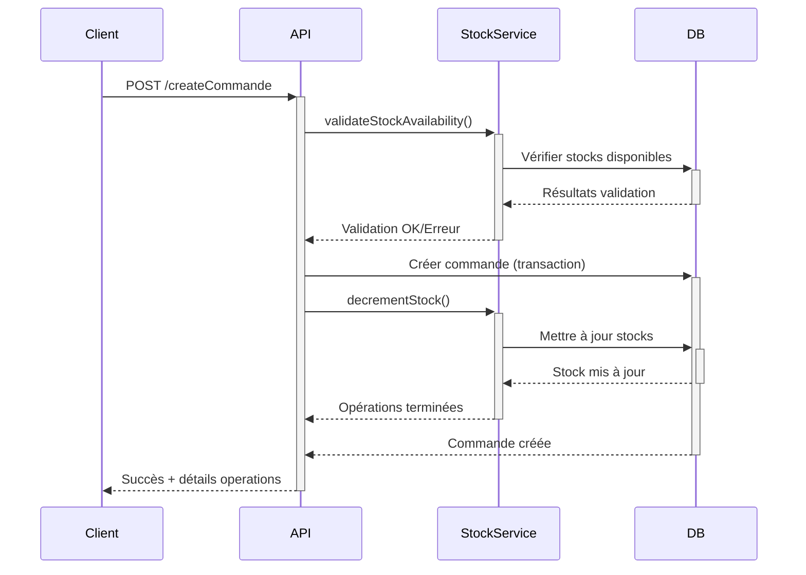
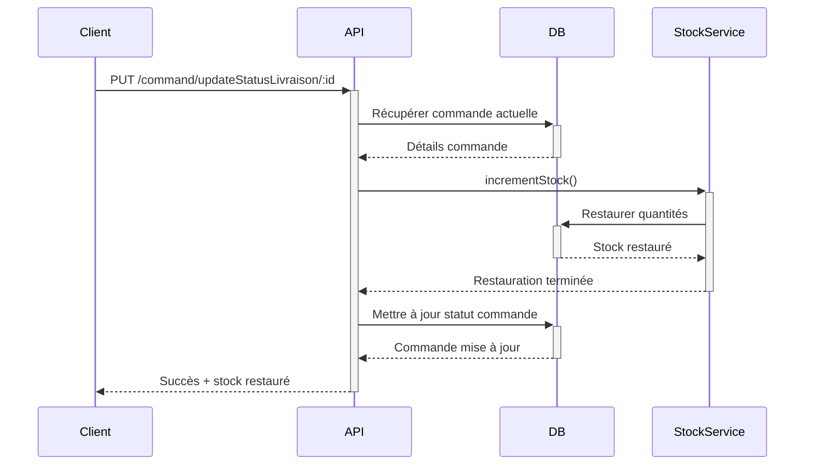

# 📦 **Documentation - Système de Gestion Automatique des Stocks**

## 🎯 **Vue d'ensemble**

Le système de gestion automatique des stocks a été implémenté pour gérer automatiquement les quantités de produits lors de la création, mise à jour, et annulation des commandes. Il prend en compte à la fois les stocks principaux et les stocks de variantes.

## 🏗️ **Architecture**

### **StockService (`/src/services/stockService.js`)**
Service principal pour toutes les opérations de gestion du stock.

### **Contrôleurs mis à jour**
- `createCommande` - Création de commande avec décrémentation automatique
- `updateCommanderef` - Mise à jour avec gestion des stocks
- `deleteCommandeById` - Suppression avec restauration du stock
- `updateStatusLivraison` - Annulation avec restauration du stock

### **Routes d'API (`/src/routes/stockRoutes.js`)**
- `/api/stock/report/:productId` - Rapport de stock
- `/api/stock/validate` - Validation de disponibilité
- `/api/stock/decrement` - Décrémentation manuelle
- `/api/stock/increment` - Incrémentation manuelle

## 🔧 **Fonctionnalités**

### **1. Gestion automatique lors des commandes**

#### **Création de commande**
```javascript
// Validation automatique du stock avant création
// Décrémentation automatique après validation
// Transaction atomique pour assurer la cohérence
```

#### **Mise à jour de commande**
```javascript
// Restauration de l'ancien stock
// Validation du nouveau stock requis
// Décrémentation du nouveau stock
```

#### **Annulation/Suppression**
```javascript
// Restauration complète du stock
// Journalisation des opérations
```

### **2. Gestion des variantes**

Le système distingue automatiquement entre :
- **Stock principal** (`produit.quantite`)
- **Stock de variante** (`produit.variants[].stock`)

#### **Logique de détection**
```javascript
const hasSpecificVariant = hasVariants && (couleurs.length > 0 || tailles.length > 0);

if (hasSpecificVariant) {
  // Utiliser le stock de la variante correspondante
} else {
  // Utiliser le stock principal
}
```

### **3. Validation avancée**

```javascript
// Exemple de validation
const validation = await StockService.validateStockAvailability([
  {
    produit: "64f1234567890abcdef12345",
    quantite: 5,
    couleurs: ["Rouge"],
    tailles: ["M"]
  }
]);

console.log(validation.valid); // true/false
console.log(validation.invalidItems); // Détails des erreurs
```

## 📊 **API Endpoints**

### **1. Rapport de stock**
```http
GET /api/stock/report/:productId
```

**Réponse :**
```json
{
  "success": true,
  "data": {
    "produitId": "64f1234567890abcdef12345",
    "name": "T-shirt Premium",
    "stockPrincipal": 100,
    "variants": [
      {
        "_id": "64f1234567890abcdef12346",
        "color": "Rouge",
        "sizes": ["S", "M", "L"],
        "stock": 15
      }
    ],
    "stockTotal": 115
  }
}
```

### **2. Validation de stock**
```http
POST /api/stock/validate
```

**Corps de la requête :**
```json
{
  "nbrProduits": [
    {
      "produit": "64f1234567890abcdef12345",
      "quantite": 5,
      "couleurs": ["Rouge"],
      "tailles": ["M"]
    }
  ]
}
```

### **3. Gestion manuelle du stock**
```http
POST /api/stock/decrement
POST /api/stock/increment
```

## 🔄 **Flux de traitement**

### **Création de commande**


### **Annulation de commande**


## 🎛️ **Configuration et monitoring**

### **Logs automatiques**
Le système génère des logs détaillés :
```javascript
console.log('✅ Stock principal mis à jour: T-shirt Premium (100 → 95)');
console.log('✅ Stock variante mis à jour: T-shirt Premium - Rouge/M (15 → 10)');
console.log('🔄 Annulation de commande - Restauration du stock...');
```

### **Gestion d'erreurs**
- **Stock insuffisant** : Erreur avec détails précis
- **Produit non trouvé** : Erreur explicite
- **Variante inexistante** : Gestion gracieuse
- **Échec de transaction** : Rollback automatique

## 🔒 **Sécurité et cohérence**

### **Transactions atomiques**
Toutes les opérations utilisent des transactions MongoDB pour assurer la cohérence :
```javascript
const session = await mongoose.startSession();
await session.withTransaction(async () => {
  // Toutes les opérations dans la transaction
});
```

### **Validation robuste**
- Vérification de l'existence des produits
- Contrôle des quantités disponibles
- Validation des variantes correspondantes

## 🚀 **Tests et déploiement**

### **Test de création de commande**
```javascript
// Test avec stock suffisant
const commande = {
  nbrProduits: [
    {
      produit: "64f1234567890abcdef12345",
      quantite: 2,
      couleurs: ["Bleu"],
      tailles: ["L"]
    }
  ],
  // ... autres champs
};

// Résultat attendu : Succès + stock décrémenté
```

### **Test d'annulation**
```javascript
// Test d'annulation de commande
// Résultat attendu : Stock restauré à l'état initial
```

## 📈 **Avantages du système**

1. **Automatisation complète** - Plus de gestion manuelle du stock
2. **Cohérence garantie** - Transactions atomiques
3. **Support des variantes** - Gestion intelligente des variantes
4. **Monitoring détaillé** - Logs complets des opérations
5. **Gestion d'erreurs robuste** - Récupération automatique en cas d'échec
6. **API flexible** - Endpoints pour monitoring et gestion manuelle

## 🛠️ **Maintenance**

### **Vérification périodique**
Utilisez l'endpoint de rapport pour vérifier l'état des stocks :
```http
GET /api/stock/report/:productId
```

### **Corrections manuelles**
En cas de nécessité, utilisez les endpoints d'incrémentation/décrémentation manuelles avec une raison explicite.

## 🔧 **Extension future**

Le système est conçu pour être facilement extensible :
- Ajout de nouveaux types de variantes
- Intégration avec des systèmes d'inventaire externes
- Notifications automatiques en cas de stock faible
- Historique détaillé des mouvements de stock
